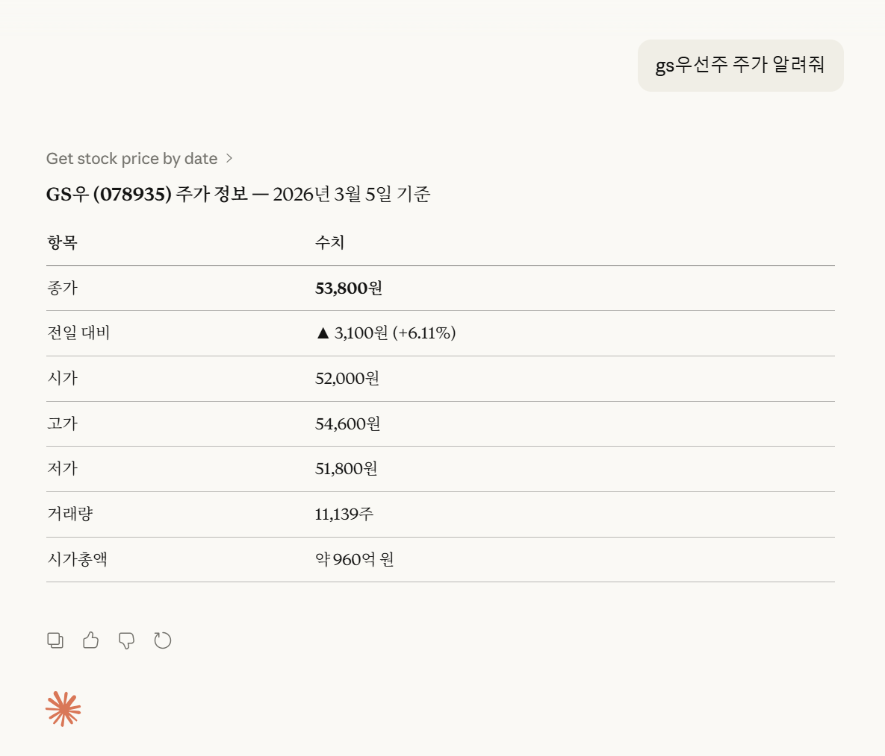

<div align="center">

## KRX-Stock MCP Server


</div>

KRX(한국거래소) API를 활용해 국내 주식 시장(KOSPI, KOSDAQ, KONEX)에 상장된 종목의 **주가**와 **종목정보**를 제공하는 MCP 서버입니다. 로컬 환경의 Claud Desktop 에서 사용하실 수 있습니다.  

&nbsp;

<div align="center">

</div>

&nbsp;

KRX-Stock MCP의 주요 특징은 다음과 같습니다.

- *'종목코드' 또는 '종목명'으로 정보 조회 가능*
- *정확한 종목명을 입력하지 않아도 정보 조회 가능*
- *주식 시장명을 함께 입력하지 않아도 정보 조회 가능*
- *특정 날짜 및 API에서 제공하는 최신 정보까지 조회 가능*
- *도구별 캐시를 활용해 API 호출 최소화*


## Primitives
KRX-Stock MCP가 제공하는 기능은 다음과 같습니다. 


- ```get_stock_info_by_date```  : 주어진 종목의 **종목정보**를 제공하는 도구(tool)입니다. 구체적인 날짜가 주어지지 않을 경우 최근 개장일 기준으로 검색합니다.

- ```get_stock_price_by_date``` : 주어진 종목의 **주가정보**를 제공하는 도구입니다. 구체적인 날짜가 주어지지 않을 경우 최근 개장일 기준으로 검색합니다.


## Enhancements
KRX-Stock MCP는 다음과 같은 추가적인 기능을 제공합니다.


#### 1. Date Watcher ```watcher.py```
날짜(KST) 변화를 모니터링합니다. 이를 통해 사용자가 구체적인 날짜를 밝히지 않아도 최신 정보를 제공 받을 수 있도록 합니다.

#### 2. Cache ```cache.py```
KRX API 요청을 최소화하기 위한 캐시(LRU) 입니다. 각 도구마다 각자의 캐시를 가지며, *'(날짜, 시장)'* 을 키로 데이터를 저장합니다. 가장 수요가 많은 최신 정보는 항상 저장하고 있습니다. 

#### 3. Resolver ```resolver.py```
 사용자가 종목명을 제공한 경우 종목명이 정확히 일치하지 않아도 응답을 받을 수 있도록 가장 유사한 종목명을 매칭합니다. 종목코드를 제공한 경우라면 해당 종목코드가 실제로 존재하는지 확인합니다.  


## Settings
KRX-Stock MCP를 사용하기 앞서 다음과 같은 환경 설정이 필요합니다.

#### 1. API 키 발급

KRX-Stock 서버를 사용하기 위해서는 KRX(한국거래소) API 키를 발급받아야 합니다. 다음 순서에 따라 API 키를 발급 받고 이용할 수 있습니다.

(1) [한국거래소 데이터마켓](https://openapi.krx.co.kr/contents/OPP/MAIN/main/index.cmd) 접속  
(2) 회원가입/로그인      
(3) '마이페이지 > API 인증키 신청'에서 인증키 발급  
(4) '서비스이용 > 주식'에서 [유가증권 일별매매정보](), [코스닥 일별매매정보](), [코넥스 일별매매정보](), [유가증권 일별매매정보](), [코스닥 종목기본정보](), [코넥스 종목기본정보]() 링크 접속 후, API 이용신청  


#### 2. Environments

**(1) 레포지토리 복사**
```
git clone https://github.com/millet04/krx-stock-mcp.git
cd krx-stock-mcp
```
위의 절차에 따라 발급 받은 API 키를 `.env.sample` 파일에 입력합니다. <u>서버 실행 전 파일명을 `.env`로 수정해야 서버가 정상적으로 실행됩니다.</u>

**(2) 라이브러리 설치**

다음과 같이 uv 환경에서 코드를 실행하는 것이 편리합니다.
```
# 동일한 라이브러리 설치
uv sync 

# 가상환경 실행
uv venv
source .venv/bin/activate   # Windows: .venv\Scripts\activate

# 서버실행 확인
uv run main.py
``` 
> Claud Desktop 에서 MCP 서버를 사용할 경우, 사용자가 직접 서버를 실행할 필요는 없습니다. 코드가 정상적으로 실행되는지만 확인하면 됩니다. 


## How to use
환경 설정을 모두 마쳤다면, Claud Desktop에 KRX-Stock MCP를 등록해야 합니다.


#### (1) Claud Desktop
Claud Desktop에서 KRX-Stock MCP를 사용하기 위해 ```'파일 > 설정 > 개발자 > claud_desktop_config.json'``` 파일을 다음과 같이 수정해야 합니다. 

```
{
  "mcpServers": {
    "krx-stock-mcp": {
      "command": "uv",
      "args": [
        "--directory",
        "C:\\...\\...\\...\\krx-stock-mcp", # main.py 가 있는 경로
        "run",
        "main.py"
      ]
    }
  }
}
```
> Claud Desktop (호스트)이 백그라운드에서 서버 역할을 하는 프로세스를 실행하고 응답을 수신합니다. 이때 호스트와 서버(프로세스)는 HTTP/HTTPS 가 아닌 **표준 입출력(STDIO)** 을 통해 통신합니다.

#### (2) Health Check
Claud Desktop 에서는 Date Watcher, Cache 등 KRX-Stock MCP의 내부 동작을 파악하기 쉽지 않습니다. 서버의 동작을 확인하기 위해 `health_check.py` 파일을 실행해 서버에 직접 요청을 보낼 수 있습니다.
```
# 서버 실행
uv run main.py --transport stramable-http

# 클라이언트 실행 (Health Check)
# -> health_check_entries.json의 값들이 서버에 요청됨
uv run health_check.py
```
